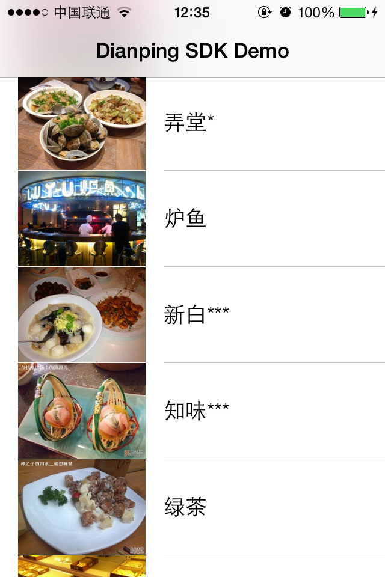

DianpingSDK
===========

大众点评SDK（非官方）   

This is an unofficial SDK for [dianping.com](http://dianping.com) Open Platform, it's targeting either iOS 6.0 and above.

The network operations are powered by the famous [AFNetWorking](https://github.com/AFNetworking/AFNetworking) library.

It is appreciated if anyone want to make this SDK better. Please feel free to fork and modify this repository.

**NOTE:** The unofficial SDK may become unavailable if dianping's API changed. 

## Usage

1. Add DianpingSDK folder to your project  
2. Import DPObject.h to your source file

See the demo for details.

## ARC

If you try to use this SDK without ARC, you need to set the *-fno-objc-arc* flag.

## Demo

## License

The MIT License
